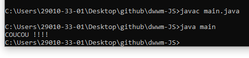

# dwwm-JAVA
Développement Web et Web Mobile - JAVA

# Compiler Java

## Sur VSCode :

class main {

    public static void main(String args[]) {

        System.out.print("COUCOU !!!!");
    }
}

System.out.println() pour le retour à la ligne

Le nom de classe doit correspondre au nom du fichier à compiler

# Sur CMD :

