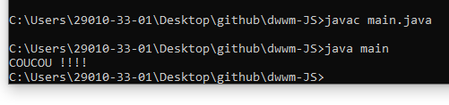

# DWWM-JS

Développeur Web et Web Mobile : JavaScript

# Algorithme Slider

## HTML :

Une div par image;

chaque image fait 100% de la largeur de la div;

Ajout de la fonction avancerReculer(1) avec l'évènement onclick sur "next";

Ajout de la fonction avancerReculer(-1) avec l'évènement onclick sur "prev";

## CSS :

Display none de toutes les images

## JavaScript :

Création d'un index initialisé à 1;

Lancement de la fonction lancerSlider avec l'index en paramètre;

Création de la fonction avancerReculer(n) :

	lancerSlider(index += n);

Création de la fonction lancerSlider(n) :

	var i;

	var slides = tableau des divs "mySlides";

On repère où on en est de l'index :

	SI (n > taille du tableau "mySlides")

		ALORS index = 1;

	SI (n < 1)

		ALORS index = taille du tableau "mySlides";

On fait une boucle sur le tableau "mySlides pour effacer toutes les divs :

	FOR (i =0; i < tailleTableau; i++)

		mySlides[i].style.display = "none";

On affiche la div de l'index -1 (la 1ère étant à 0) :

	slides[index-1].style.display = "block";
	

## Compiler Java

# Sur VSCode :

class main {

    public static void main(String args[]) {

        System.out.print("COUCOU !!!!");
    }
}

System.out.println() pour le retour à la ligne

Il faut que le fichier lancé (main) ait le même nom que celui de la class (class main).

# Sur CMD :
